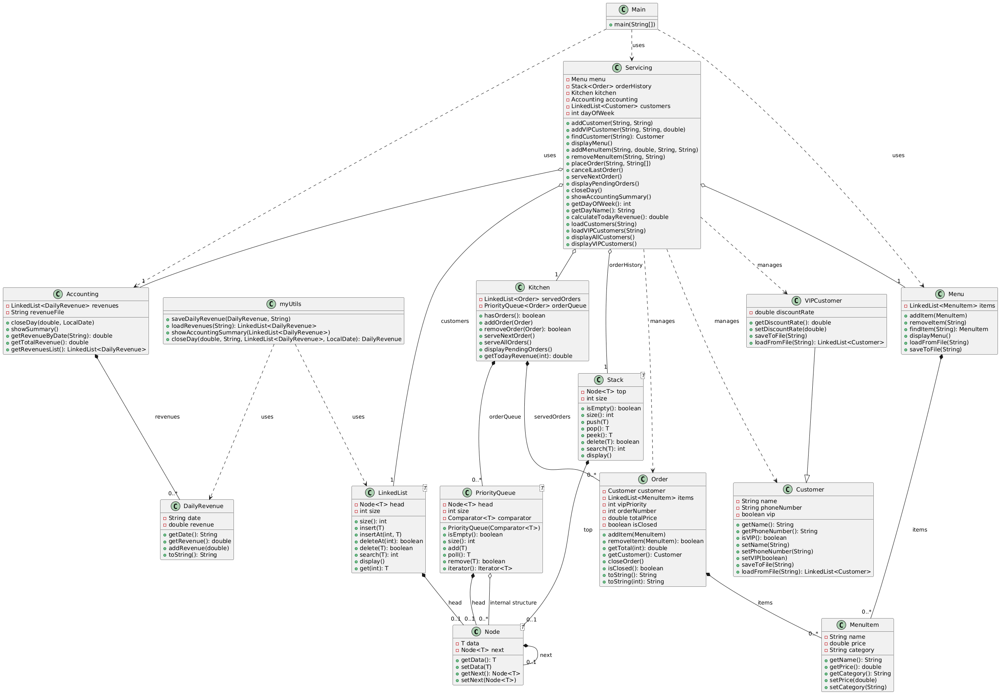

# 🍽️ Restaurant Management System (Java)

A complete **console-based Restaurant Management System** implemented in **Java**, designed to demonstrate **Object-Oriented Programming**, **custom data structures**, and **software architecture principles** through a real-world domain.

This project simulates restaurant operations such as menu management, customer & VIP handling, order processing, kitchen prioritization, accounting, and persistent storage — **without using Java’s built-in collections**, relying instead on **manually implemented data structures**.

---

## 🚀 Project Overview

Restaurants rely on efficient coordination between orders, customers, kitchen workflow, and accounting. This system models those workflows using:

- Object-Oriented Design (Inheritance, Composition, Interfaces)
- Custom Data Structures (Linked List, Stack, Priority Queue)
- File-based persistence (simulated database)
- Clear separation of responsibilities across system components

The result is a functional, extensible restaurant management application that mirrors real-life operational logic.

---

## 🧠 Key Objectives Achieved

- ✔️ Design an extensible **OOP architecture**
- ✔️ Implement **core data structures from scratch** using Generics
- ✔️ Manage customers, VIPs, menu items, and orders
- ✔️ Prioritize VIP orders using a **custom Priority Queue**
- ✔️ Enable order cancellation using a **Stack (LIFO)**
- ✔️ Track daily revenue using **Linked Lists**
- ✔️ Ensure **data persistence** using text files

---

## 🛠️ Tech Stack

- **Language:** Java
- **Paradigm:** Object-Oriented Programming (OOP)
- **Data Structures:** Linked List, Stack, Priority Queue, Node-based structures
- **Persistence:** Text files (simulated database)
- **Interface:** Console-based (Scanner input)

---

## 🏗️ Program Engineering & Architecture

The system follows a **layered architecture** that separates concerns and improves maintainability:

### 🔹 1. Data Structures Layer
Implemented **from scratch** using Java Generics for reusability and type safety:

- **Node<T>** – Base building block for all linear structures
- **LinkedList<T>** – Stores customers, menu items, served orders, and revenues
- **Stack<T>** – Enables undo functionality for order cancellation (LIFO)
- **PriorityQueue<T>** – Manages kitchen orders based on VIP priority and FIFO order

📌 *No Java Collections Framework was used.*

---

### 🔹 2. Restaurant Components Layer
Domain-specific components built on top of the data structures:

- **Customer / VIPCustomer** – VIPCustomer extends Customer with discount logic
- **MenuItem / Menu** – Dynamic menu management
- **Order** – Encapsulates ordered items, priority, and total price
- **Kitchen** – Core processing engine using PriorityQueue<Order>
- **Accounting / DailyRevenue** – Revenue tracking and summaries
- **Servicing** – Central controller connecting all components
- **myUtils** – File handling & persistence utilities
- **Main** – Console UI and system entry point

This layered design ensures **high cohesion** and **low coupling**.

---

## 📐 UML Diagram

The UML diagram illustrates:

- Inheritance (`VIPCustomer → Customer`)
- Composition (`Kitchen` contains `PriorityQueue<Order>`)
- Associations between Menu, Orders, Customers, and Accounting
- Separation between data structures and business logic

📎 **UML Diagram:**

---

## 📊 Data Structures Usage

| Data Structure | Used For |
|---------------|---------|
| Linked List | Customers, Menu Items, Served Orders, Revenue Logs |
| Priority Queue | Active kitchen orders (VIP-first, FIFO) |
| Stack | Order cancellation (undo feature) |
| Node | Foundation for all structures |

---

## 🔄 System Logic & Workflow

1. Register customers (regular or VIP)
2. Maintain a dynamic restaurant menu
3. Place orders with multiple items
4. VIP orders are prioritized automatically
5. Orders can be canceled using undo (Stack)
6. Kitchen serves orders in correct priority
7. Daily revenue is calculated and stored
8. Data is persisted across program runs

---

## ✨ Key Method Highlights

### Data Structures

**LinkedList<T>**
- `insert(T data)`
- `delete(T value)`
- `search(T value)`
- `get(int index)`

**Stack<T>**
- `push(T data)`
- `pop()`
- `peek()`

**PriorityQueue<T>**
- `add(T element)`
- `poll()`
- `remove(T element)`

---

### Core Components

**Customer / VIPCustomer**
- `saveToFile()` / `loadFromFile()`
- VIP discount handling

**Menu / MenuItem**
- `addItem()` / `removeItem()`
- `findItem()` / `displayMenu()`

**Order**
- `addItem()` / `removeItem()`
- `getTotal(dayOfWeek)`
- `closeOrder()`

**Kitchen**
- `addOrder()`
- `serveNextOrder()`
- `serveAllOrders()`
- `displayPendingOrders()`

**Accounting**
- `closeDay()`
- `showSummary()`

---

## 🖥️ Console Menu (Main.java)

The application runs through a **switch-case menu**:

| Option | Action |
|------|-------|
| 1 | Add Customer |
| 2 | Add VIP Customer |
| 3 | Display Menu |
| 4 | Add Menu Item |
| 5 | Remove Menu Item |
| 6 | Place Order |
| 7 | Serve Next Order |
| 8 | Display Pending Orders |
| 9 | Display All Customers |
| 10 | Display VIP Customers |
| 11 | Close Day |
| 12 | Show Accounting Summary |

---

## 💾 Data Persistence

Text files are used to simulate a lightweight database:

- Customers
- VIP Customers
- Menu Items
- Daily Revenue Logs

This ensures consistency across executions while respecting project constraints.

---

## 🎯 Real-Life Applications

- Restaurant & café automation
- VIP loyalty systems
- Kitchen workflow optimization
- Revenue tracking and reporting
- Educational demonstration of OOP & Data Structures

---

## ✅ Conclusion

This project demonstrates how **classical data structures** and **object-oriented design** can be effectively applied to solve real-world problems. The system serves as both a **functional application** and a **strong academic showcase** for OOP, data structures, and software engineering principles.

---

## 📚 References

- Java Documentation
- Object-Oriented Programming Concepts
- Data Structures & Algorithms (Linked Lists, Stacks, Queues)

